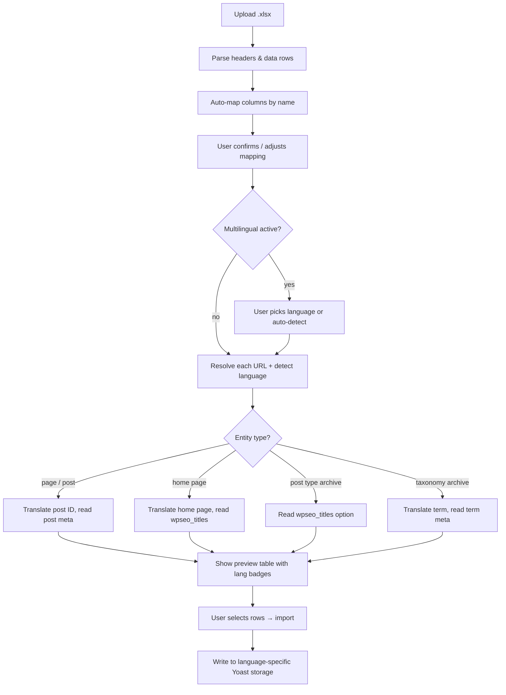

# Yoast SEO Meta Importer

A WordPress plugin that lets you bulk-import Yoast SEO titles and meta descriptions from an Excel (`.xlsx`) file — with an interactive preview step before anything is saved.

## Features

- **Upload `.xlsx`** — drop in your spreadsheet, the plugin parses it instantly (no button press needed)
- **Smart column mapping** — auto-detects URL, title, and description columns by header name
- **Interactive preview** — side-by-side comparison of current vs. new Yoast values before you commit
- **Selective import** — check/uncheck individual rows to skip pages you don't want to touch
- **Safe & non-destructive** — writes to the correct Yoast storage for each entity type (post meta, `wpseo_titles` option, term meta)
- **Zero external dependencies** — uses PHP's built-in `ZipArchive` + `SimpleXML` to read Excel files
- **URL resolution** — supports pages, posts, the home page, custom post type archives, and taxonomy term archives
- **Multilingual** — works with WPML and Polylang: auto-detect language from URL paths or pick a language per file

## Requirements

- WordPress 5.0+
- PHP 7.4+ with `zip` extension enabled
- [Yoast SEO](https://wordpress.org/plugins/wordpress-seo/) plugin active

## Installation

1. Download or clone this repository into `wp-content/plugins/wp-yoast-meta-import/`
2. Activate the plugin from **Plugins → Installed Plugins**
3. Go to **Tools → SEO Meta Import**

## Usage

### Step 1 — Upload

1. Navigate to **Tools → SEO Meta Import**
2. Click **Choose File** and select your `.xlsx` spreadsheet
3. The file is parsed immediately — column mapping dropdowns appear with auto-detected matches
4. Adjust the mapping if needed, then click **Upload & Preview**

### Step 2 — Preview & Import

1. A comparison table shows every row from your spreadsheet
2. You'll see: page name, URL, current Yoast title/description, and new title/description
3. Bold values indicate a change; rows with unresolved URLs show a red "not found" badge
4. Uncheck any rows you want to skip
5. Click **Import Selected Rows** to apply the changes

### Spreadsheet Format

Your `.xlsx` file should have a header row plus data rows. Example:

| URL                        | Meta Title         | Meta Description          |
| -------------------------- | ------------------ | ------------------------- |
| https://example.com/       | Homepage SEO Title | Homepage meta description |
| https://example.com/about/ | About Us           | About page description    |

The column names don't need to match exactly — you map them in the UI. The plugin auto-detects common patterns like "URL", "Meta Title", "Meta Description".

### Supported URL Types

The plugin resolves URLs to different WordPress entities and writes Yoast SEO data to the correct location:

| URL example                          | Entity type                                                | Yoast storage                                                                |
| ------------------------------------ | ---------------------------------------------------------- | ---------------------------------------------------------------------------- |
| `https://example.com/`               | **Home page** (front page or blog)                         | `wpseo_titles` option (`title-home-wpseo` / `metadesc-home-wpseo`)           |
| `https://example.com/about/`         | **Page / Post**                                            | Post meta (`_yoast_wpseo_title` / `_yoast_wpseo_metadesc`)                   |
| `https://example.com/realisaties/`   | **Post type archive** (e.g. `/realisaties/` CPT archive)   | `wpseo_titles` option (`title-ptarchive-{cpt}` / `metadesc-ptarchive-{cpt}`) |
| `https://example.com/category/news/` | **Taxonomy term archive** (category, tag, custom taxonomy) | Term meta + `wpseo_taxonomy_meta` option                                     |

The preview will show the detected entity type as a badge next to each row (e.g. `page`, `home`, `projecten` for a CPT archive).

## Multilingual Sites (WPML / Polylang)

The plugin auto-detects WPML or Polylang and adds language awareness.

### Two modes

**Mode 1 — Auto-detect from URL** (zero setup, the default)

The plugin inspects the URL path. If your site uses directory-based language URLs:

| URL                             | Detected language | Resolves to                  |
| ------------------------------- | ----------------- | ---------------------------- |
| `https://example.com/nl/about/` | `nl`              | Dutch version of `/about/`   |
| `https://example.com/en/about/` | `en`              | English version of `/about/` |
| `https://example.com/about/`    | default lang      | Primary language version     |

The language prefix is stripped before resolving the page, then the resolved post/term ID is translated to the correct language variant. Works for mixed-language XLSX files — each row can target a different language based on its URL.

**Mode 2 — One XLSX per language**

When WPML or Polylang is active, a **Language dropdown** appears in Step 1. Pick one language (e.g. "Nederlands (nl)") and every row in that file is imported for that language. Ideal when you maintain separate spreadsheets per language with the same URL structure.

If the dropdown is left at "Auto-detect from URLs", Mode 1 kicks in.

### XLSX format with languages

The XLSX format does **not** require a language column. The same 3-column format works for both modes:

| URL | Meta Title | Meta Description |
| --- | ---------- | ---------------- |

Language comes from one of:

- The URL path (`/nl/slug/`, `/en/slug/`, etc.) in auto-detect mode
- The **Language dropdown** you pick in Step 1 (one language per file)

In the preview, each row shows a colored language badge (e.g. `NL`, `EN`) next to the entity badge.

### Where language-specific data is written

| Entity type       | Multilingual storage                                                                 |
| ----------------- | ------------------------------------------------------------------------------------ |
| Page / Post       | Language-specific post meta (WPML/Polylang translations each have their own post ID) |
| Home page         | Language-specific front page post meta                                               |
| Post type archive | `wpseo_titles` option key for that language + post type                              |
| Taxonomy term     | Language-specific term meta                                                          |

When no multilingual plugin is active, the language logic is a no-op — everything works exactly as before.

## How It Works



- Parsed data is stored in WordPress transients (expires after 1 hour)
- All AJAX endpoints are nonce-protected and require `manage_options` capability
- The XLSX reader (`lib/SimpleXLSX.php`) is a lightweight single-file library using `ZipArchive` + `SimpleXML`

## File Structure

```
wp-yoast-meta-import/
├── wp-yoast-meta-import.php   # Main plugin file
├── lib/
│   ├── Multilingual.php       # WPML/Polylang abstraction layer
│   └── SimpleXLSX.php         # Bundled XLSX reader
├── assets/
│   ├── css/
│   │   └── admin.css          # Admin page styles
│   └── js/
│       └── admin.js           # Two-step interactive flow
└── example/
    └── climatoni_seo_metadata.xlsx  # Example spreadsheet
```

## License

GPL-2.0+
