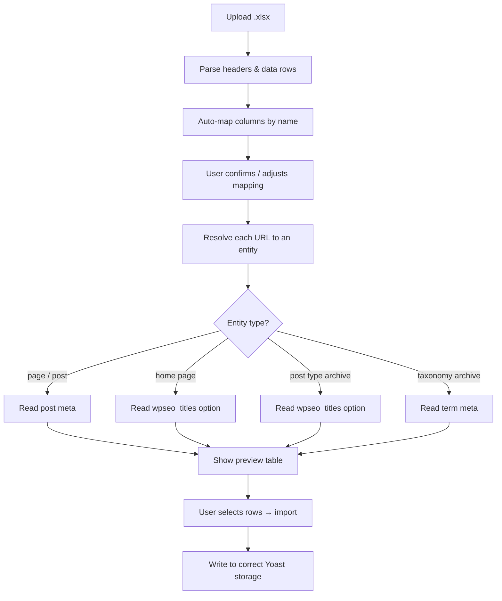

# Yoast SEO Meta Importer

A WordPress plugin that lets you bulk-import Yoast SEO titles and meta descriptions from an Excel (`.xlsx`) file — with an interactive preview step before anything is saved.

## Features

- **Upload `.xlsx`** — drop in your spreadsheet, the plugin parses it instantly (no button press needed)
- **Smart column mapping** — auto-detects URL, title, and description columns by header name
- **Interactive preview** — side-by-side comparison of current vs. new Yoast values before you commit
- **Selective import** — check/uncheck individual rows to skip pages you don't want to touch
- **Safe & non-destructive** — writes to the correct Yoast storage for each entity type (post meta, `wpseo_titles` option, term meta)
- **Zero external dependencies** — uses PHP's built-in `ZipArchive` + `SimpleXML` to read Excel files
- **URL resolution** — supports pages, posts, the home page, custom post type archives, and taxonomy term archives

## Requirements

- WordPress 5.0+
- PHP 7.4+ with `zip` extension enabled
- [Yoast SEO](https://wordpress.org/plugins/wordpress-seo/) plugin active

## Installation

1. Download or clone this repository into `wp-content/plugins/wp-yoast-meta-import/`
2. Activate the plugin from **Plugins → Installed Plugins**
3. Go to **Tools → SEO Meta Import**

## Usage

### Step 1 — Upload

1. Navigate to **Tools → SEO Meta Import**
2. Click **Choose File** and select your `.xlsx` spreadsheet
3. The file is parsed immediately — column mapping dropdowns appear with auto-detected matches
4. Adjust the mapping if needed, then click **Upload & Preview**

### Step 2 — Preview & Import

1. A comparison table shows every row from your spreadsheet
2. You'll see: page name, URL, current Yoast title/description, and new title/description
3. Bold values indicate a change; rows with unresolved URLs show a red "not found" badge
4. Uncheck any rows you want to skip
5. Click **Import Selected Rows** to apply the changes

### Spreadsheet Format

Your `.xlsx` file should have a header row plus data rows. Example:

| URL                        | Meta Title         | Meta Description          |
| -------------------------- | ------------------ | ------------------------- |
| https://example.com/       | Homepage SEO Title | Homepage meta description |
| https://example.com/about/ | About Us           | About page description    |

The column names don't need to match exactly — you map them in the UI. The plugin auto-detects common patterns like "URL", "Meta Title", "Meta Description".

### Supported URL Types

The plugin resolves URLs to different WordPress entities and writes Yoast SEO data to the correct location:

| URL example                          | Entity type                                                | Yoast storage                                                                |
| ------------------------------------ | ---------------------------------------------------------- | ---------------------------------------------------------------------------- |
| `https://example.com/`               | **Home page** (front page or blog)                         | `wpseo_titles` option (`title-home-wpseo` / `metadesc-home-wpseo`)           |
| `https://example.com/about/`         | **Page / Post**                                            | Post meta (`_yoast_wpseo_title` / `_yoast_wpseo_metadesc`)                   |
| `https://example.com/realisaties/`   | **Post type archive** (e.g. `/realisaties/` CPT archive)   | `wpseo_titles` option (`title-ptarchive-{cpt}` / `metadesc-ptarchive-{cpt}`) |
| `https://example.com/category/news/` | **Taxonomy term archive** (category, tag, custom taxonomy) | Term meta + `wpseo_taxonomy_meta` option                                     |

The preview will show the detected entity type as a badge next to each row (e.g. `page`, `home`, `projecten` for a CPT archive).

## How It Works



- Parsed data is stored in WordPress transients (expires after 1 hour)
- All AJAX endpoints are nonce-protected and require `manage_options` capability
- The XLSX reader (`lib/SimpleXLSX.php`) is a lightweight single-file library using `ZipArchive` + `SimpleXML`

## File Structure

```
wp-yoast-meta-import/
├── wp-yoast-meta-import.php   # Main plugin file
├── lib/
│   └── SimpleXLSX.php         # Bundled XLSX reader
├── assets/
│   ├── css/
│   │   └── admin.css          # Admin page styles
│   └── js/
│       └── admin.js           # Two-step interactive flow
└── example/
    └── climatoni_seo_metadata.xlsx  # Example spreadsheet
```

## License

GPL-2.0+
